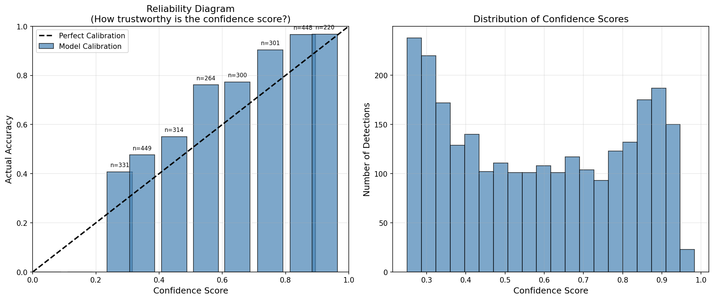
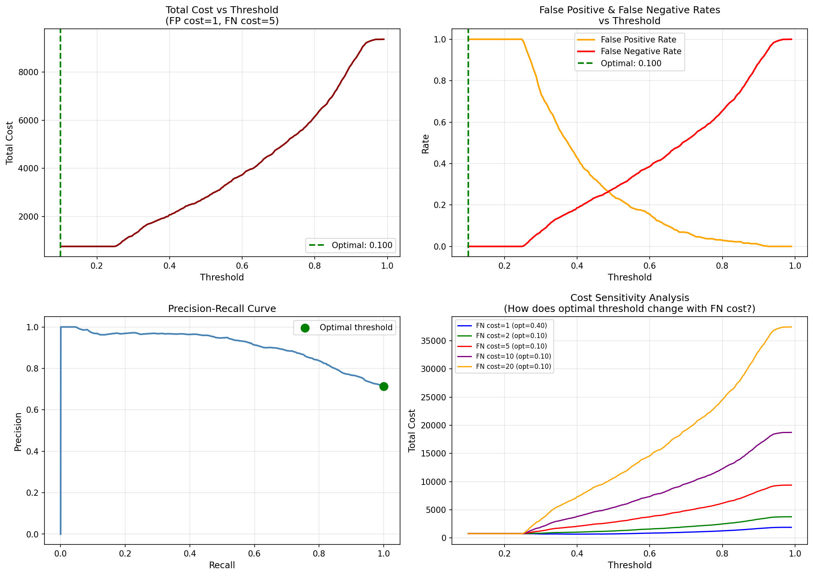

# Uncertainty-Aware Computer Vision
## Human-in-the-Loop Safety Review System

A data science project studying whether AI confidence scores 
can be trusted for human review decisions in safety-critical 
detection systems.

## Core Question
When an AI says it's confident — should we trust it?

## Key Findings
- YOLOv8n ECE of 0.1271 — model is systematically underconfident
- Optimal threshold collapses to 0.10 under asymmetric costs
- When costs are equal, optimal threshold stabilizes at 0.40
- Mathematical optimality and operational feasibility conflict

## Project Files
- first_detection.py — basic detection pipeline
- collect_predictions.py — runs model on 500 COCO validation images
- calibration_analysis.py — reliability diagram and ECE calculation
- threshold_optimization.py — cost-based threshold analysis
- dashboard.py — interactive Streamlit dashboard

## Results

## Tech Stack
Python, YOLOv8, OpenCV, NumPy, Pandas, Scikit-learn, 
Matplotlib, Streamlit